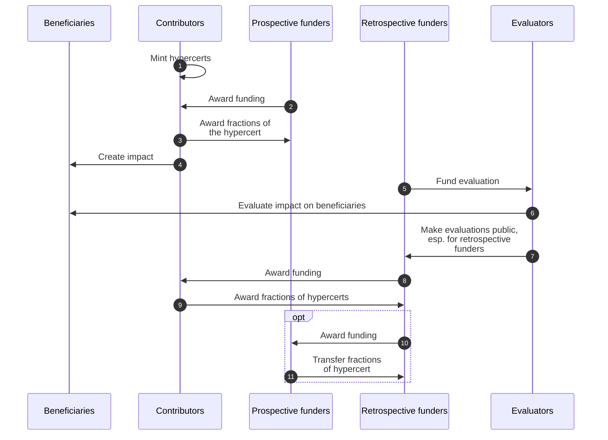

In order for impact funding systems to be most effective, they should be interoperable regarding (1) funding mechanisms, (2) funding sources and (3) evaluations. Figure 1 shows a potential dynamic between the actors of an IFS. In that scenario hypercerts can account for the prospective funding (steps 2-3) as well as for the retrospective funding (steps 8-9) from different funders. Evaluations are made public and can be discovered through the hypercerts for all funders (steps 5-7). Retrospective funders can reward not only the contributors but also the prospective funders (steps 10-11).

By serving as a single, open, shared, decentralized database hypercerts lower the transaction costs to coordinate and fund impactful work together. This is important because the optimal funding decisions of a single funder depends on the funding decision of all other funders. For instance, some work is only impactful if a minimum funding is provided: The impact is non-linear in the funding amount, e.g. half a bridge is not half as impactful as a full bridge. Other work might be over-funded, i.e. the impact of an additional dollar is basically zero. Ultimately, funders want to find the highest impact for each additional dollar spend (cf. S-process as in Critch, 2021). Today multi-funder coordination on impact funding is prohibitively expensive, leading to suboptimal efficiency in impact capital allocation.  Through hypercerts the funding becomes more transparent and the credits for funding impactful work can be easily shared. Coordinating funding becomes easier.

Hypercerts don’t solve this coordination problem by themselves, but build the basis for different decision and funding mechanisms as shown in figure 2. Quadratic voting, bargaining solutions, DAO-style votes, milestone bounties, and simple unconditional grants all have their strengths, among others. Hypercerts do not lock in any particular decision-making scheme for funders.

Looking farther into the future: If a large majority of funding across an entire IFS ends up flowing through hypercerts, funders have created the transparency that enables each of them to make the best decisions given the funding decision of everyone else.
