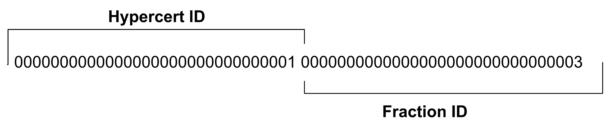

### Hypercerts as a semi-fungible token

In order to make the token identifiable, traceable, and transferable, hypercerts are represented as [ERC-1155 tokens](https://eips.ethereum.org/EIPS/eip-1155). The ERC-1155 standard enables a single deployed contract to store many hypercerts, facilitating simpler creation, transfers, as well as splitting and merging of hypercerts within a single namespace. As a semi-fungible token, each unique token represents a fraction of ownership of a hypercert. Hypercerts are then represented as a group of tokens, where the total ownership sums to 100%. In order to easily identify which hypercert a token belongs to, we utilize the upper 128 bits of a 256-bit token ID to identify the hypercert. All tokens within the same hypercert group should share the same [ERC-1155 Metadata](https://eips.ethereum.org/EIPS/eip-1155#metadata).

For illustrative purposes, let us assume that token IDs are just 2 bytes long, where the first byte represents the hypercert ID and the last byte represents which fraction of ownership. Alice could create a new hypercert token 0x2301, representing 100% of hypercert 0x23. If Alice wanted to transfer 20% to Bob, Alice could perform a split operation by minting token 0x2302 and transferring 20% of value to it, such that tokens 0x2301 and 0x2302 represent 80% and 20% ownership respectively of hypercert 0x23. Then Alice transfers token 0x2302 to Bob. Similarly, they could merge these 2 tokens together, back to form a token that represented 100% ownership. In this case, the value of 0x2301 would be transferred to 0x2302, and then 0x2301 is subsequently burned.

Alice can also choose to split or merge hypercerts along some dimension of the impact space. For example, Alice may split hypercert 0x23 into two new hypercerts — 0x24 representing work done before the year 2000, and 0x25 representing work done after 2000. The original hypercert 0x23 is burned and the two new hypercerts store a reference to the previous hypercert. When the history of splits and merges are indexed, we can easily trace through the provenance of any individual hypercert.

### Claim Data

Hypercert claim data, such as scope of work and the contributor list, is encoded in JSON format into the [ERC-1155 Metadata](https://eips.ethereum.org/EIPS/eip-1155#metadata). Claim data can be stored on-chain alongside the token, or in off-chain storage such as IPFS. For details on the JSON schema and how off-chain storage can be utilized, see the [hypercerts-sdk repository](https://github.com/hypercerts-org/hypercerts/tree/main/sdk).

When considering whether to store hypercert metadata on-chain or off-chain, we can consider the different trade-offs to the user experience and cost, which may differ depending on which blockchain is being used. Storing data off-chain saves on costs, but could lead to on-chain claims without the metadata. Storing data on-chain adds additional security that the claims will not be forgotten but can lead to higher gas fees.

Beyond the standard fields of hypercerts that locate the hypercert in the impact space, additional fields can be added. This allows for different templates in different impact areas, such as AI safety or biodiversity, as different additional information will be useful. Importantly, however, all hypercerts will be located in a single impact space – the additional fields do not change that.

### Multi-chain support

We expect hypercerts to exist in a multi-chain ecosystem, where the local deployment can be used to support the unique funding systems of that community. In order to visualize a single global impact space, we index the different contract deployments across chains and surface any potential hypercert claim conflicts. Because different blockchains support different subsets of programming languages, we do expect different implementations of the hypercert protocol to exist. However, they must adhere to the same hypercert data model to be indexed into the impact space.

In order to decide which deployments to index into the hypercerts impact space, decentralized governance institutions will be used to govern the list of contract addresses used across all blockchains.
