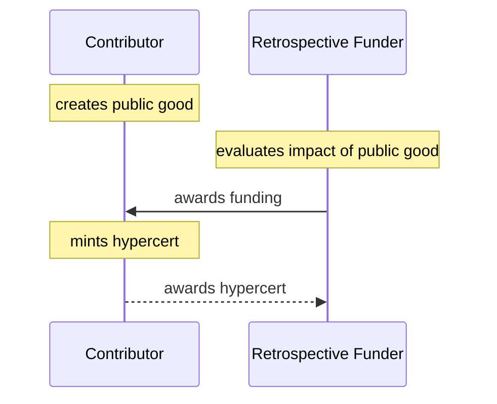
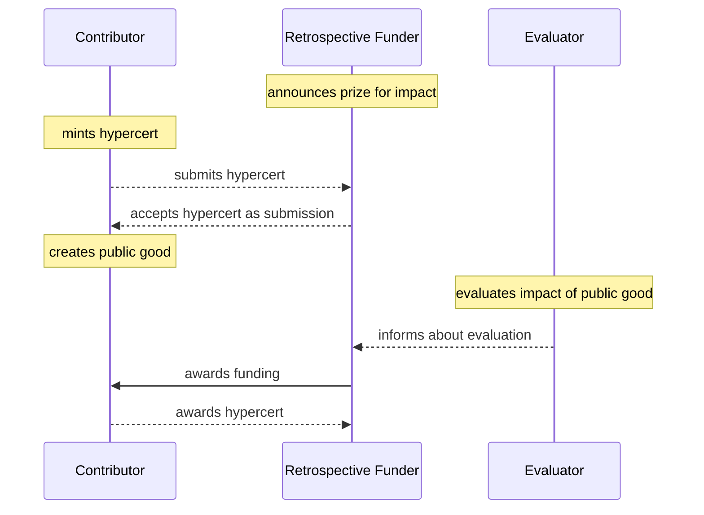
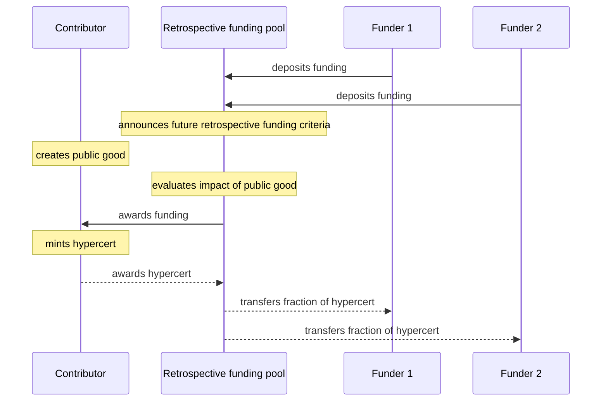
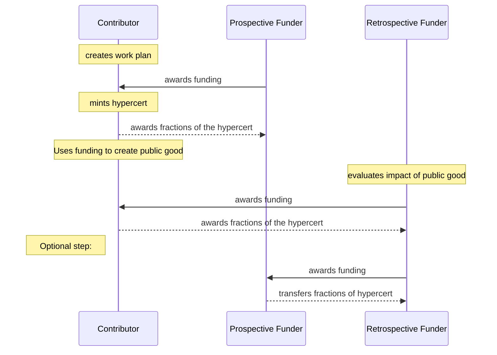

Hypercerts are a key building block for an open ecosystem of retrospective funding and tangible impact. This outlines some potential scenarios we're exploring.

## Hypercerts with simple retroactive funding
In the simplest version of hypercerts, retrospective funders use hypercerts to award funding to contributors. 

If retrospective funding becomes the norm, contributors can reliably expect to get funding for creating positive impact. This expectation incentivizes them to start creating public goods.

However, until it's a norm, we need additional tools to create reliable expectations about future retrospective funding that incentivizes contributors to create public goods. This includes existing mechanisms like prize competitions.

## Prize competition with hypercerts
A funder announces a prize that is given out under specific criteria to create reliable expectations about future retrospective rewards. hypercerts lower transaction costs if multiple funders use these in their prize competitions.

## Retrospective funding pool
Smaller funders don't have the funds to create the optimal incentives with retrospective rewards. Hence multiple Funders can pool funds to achieve bigger goals. They announce funding criteria to create reliable expectations about future retrospective funding. This incentivizes contributors to start working towards these criteria.

Every funder will receive fractions of the impactful hypercerts to track the impact of their funding.

## Hypercerts with pro- and retroactive funding
Contributors can't always bootstrap their project without initial funding. When prospective funders are needed, hypercerts make it easy to track their funding and its impacts. 

In some cases the retrospective funder can also reward the prospective funder for making this project happen.

