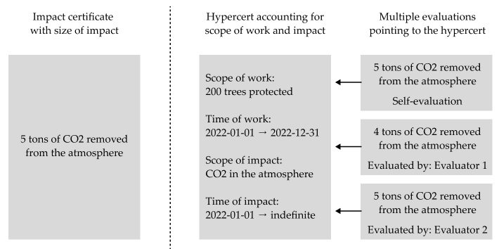

A key design element is that hypercerts themselves do not make a claim about the size of the impact, but only account for the work that is supposed to be impactful. The figure below shows this contrast in a simplified illustration of the example that we introduced above. The open evaluation system allows multiple evaluations to point at the same area of the impact space that a hypercert claims. The evaluations can include self-evaluation from the contributors themselves. Funders observe these and make their funding decisions based on this richer set of information.

The open evaluation system is also used to provide additional information, e.g. an evaluator or the project itself provides information about the health of the trees. This information can then be used transparently by other evaluators to evaluate the impact on CO2 in the atmosphere.

An important feature is that the evaluations do not directly point at a hypercert, but rather at an area in the impact space. In practice this area will mostly be the exact same area that a hypercert claims, such that it can be considered an evaluation of the hypercert, but it does not have to. This feature ensures that, if hypercerts are merged or split, previous evaluations will continue to be linked appropriately.

The form of evaluations can be standardized to simplify handling and comparing multiple evaluations from multiple evaluators. The open evaluation system allows for templates to be created and used by any evaluators. Similar to the emerging ontologies, these are not enforced centrally, but should emerge as useful standards – potentially steered by decentralized governance institutions.

Important characteristics of the open evaluation system are:
- Evaluators can submit multiple evaluations of the same area in the impact space as more information becomes available
- Evaluations can challenge other evaluations
- Evaluation methodologies can evolve over time

These features allow the whole evaluation system to be dynamically improved by each actor. The relevant incentives for this improvement will stem from the funders who will value the signals from some evaluators more than others and evaluators are able to build up reputation.
