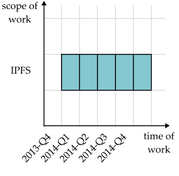
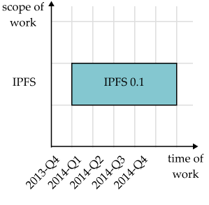

### Defining hypercerts
A hypercert is a semi-fungible token that accounts for work that is supposed to be impactful and represents all or parts of that impact. A hypercert has the following fields (one for each dimension):
1. **Set of contributors:** An ordered list of all contributors, who claim to do or have done the work described by this hypercert.
2. **Scope of work:** A conjunction of potentially-negated work scope tags, where an empty string means “all”:
```
<scope-of-work> ::= <scope-atom> AND <scope-of-work> | " "
<scope-atom> ::= <scope-tag> | NOT <scope-tag>
```
3. **Time of work:** A date range, from the start to the end of the work being claimed by this hypercert.
4. **Scope of impact:** A conjunction of potentially-negated impact scope tags, where an empty string means “all”:
```
<scope-of-impact> ::= <scope-atom> AND <scope-of-impact> | " "
<scope-atom> ::= <scope-tag> | NOT <scope-tag>
```
5. **Time of impact:** Date ranges from the start to the end of the impact.
6. **Rights of the owners:** An unordered list of usage rights tags, which define the rights of the owners of this hypercert over the work being claimed by this hypercert.

Implementing hypercerts as a semi-fungible token allows multiple contributors and funders to own parts of hypercerts. For instance the original contributors can award 10% of a hypercert to a funder, while keeping 90%, which they can award to other funders later. This is why hypercerts are fractionalizable.

### Examples
In the simplest cases of hypercerts, the scope of work and impact as well as the time of impact are not restricted and no rights are transferred to owners of the hypercerts, i.e. the hypercerts just define the who (set of contributors) and when (time of work) of the claimed work. Scope of work and impact would be set to all, time of impact to “indefinite” and the rights to only “public display of support”. The latter is always included as the hypercert is a public record, such that owners will always automatically display their support of the work.

Take for example hypercert 1 below: It represents all work that contributor 1 has performed in 2013 with all the impact that the work had from the beginning of the work; the hypercert doesn’t give any additional rights to the owners of the hypercert.

The other fields – except the rights field – can be used to limit the work or impact that is represented by the hypercert. Hypercert 2 limits this to the work on IPFS in 2013, i.e. any other work besides IPFS that contributor 1 performed is not included. Hypercert 3 limits it even further as it excludes a specific aspect of IPFS, the go-ipfs implementation.

|                         | **Hypercert 1**           | **Hypercert 2**           | **Hypercert 3**           |
|-------------------------|---------------------------|---------------------------|---------------------------|
| **Set of contributors** | Contributor 1             | Contributor 1             | Contributor 1             |
| **Scope of work**       | all                       | IPFS                      | IPFS ∧ ¬ go-ipfs          |
| **Time of work**        | 2013-01-01 to 2013-12-31  | 2013-01-01 to 2013-12-31  | 2013-01-01 to 2013-12-31  |
| **Scope of impact**     | all                       | all                       | all                       |
| **Time of impact**      | 2013-01-01 → indefinite   | 2013-01-01 → indefinite   | 2013-01-01 → 2013-12-31   |
| **Rights**              | Public display of support | Public display of support | Public display of support |

In the table below we illustrate a use case for limiting the scope of impact. Suppose contributor 1 protects trees in a certain area. This work has positive effects on the CO2 in the atmosphere and could turn into carbon credits; however, the trees have additional positive impacts, such as protecting biodiversity. Instead of including all positive impacts in one hypercert (hypercert 4), the impact can be split between the impact on CO2 in the atmosphere (hypercert 5) and all other positive impacts (hypercert 6). If funders are willing to pay for biodiversity, this would be a new income opportunity. And it would account for the additional positive impact that other methods of reducing CO2 might not have, like industrial carbon capture. Importantly, negative impacts can not be excluded from a hypercert.

|                         | **Hypercert 4**            | **Hypercert 5**            | **Hypercert 6**            |
|-------------------------|----------------------------|----------------------------|----------------------------|
| **Set of contributors** | Contributor 1              | Contributor 1              | Contributor 1              |
| **Scope of work**       | Protecting trees in area X | Protecting trees in area X | Protecting trees in area X |
| **Time of work**        | 2013-01-01 to 2013-12-31   | 2013-01-01 to 2013-12-31   | 2013-01-01 to 2013-12-31   |
| **Scope of impact**     | all                        | CO2 in atmosphere          | all ∧ ¬ CO2 in atmosphere  |
| **Time of impact**      | 2013-01-01 → indefinite    | 2013-01-01 → indefinite    | 2013-01-01 → indefinite    |
| **Rights**              | Public display of support  | Public display of support  | Public display of support  |

Importantly a hypercert does not specify the “size” of the impact, e.g. a hypercert does not state “5 tons of CO2 removed from the atmosphere.” Instead the hypercert only defines the work, e.g. “200 trees protected” (scope of work) in 2022 (time of work). The size of the impact is then left to the evaluations of the “CO2 in the atmosphere” (scope of impact) in 2022 (time of impact) that point towards the covered region of the hypercert. For instance: This allows a self evaluation to claim that 5 tons of CO2 were removed in a given year as well as one or multiple evaluations from independent auditors to confirm or challenge how much CO2 has been removed. An evaluator could detect that some of the trees were not healthy and hence only 4 tons of CO2 were removed. Allowing for multiple evaluation is a defining characteristic of the open evaluation system.

### Functions of hypercerts

#### 1. Identifiability
Hypercerts clearly define the work that is supposed to be impactful by creating a record of who (set of contributors) claims to do or have done what (scope of work) in what time period (time of work). They also allow the creation of multiple records of the same work to identify separate impacts that this work had or will have (scope of impact) over specified time periods (time of impact).

#### 2. Traceability
As these records are public and logically monotonic (immutable, except to split or merge hypercerts), records are durable and permanent.

#### 3. Transferability
The records are a digital object that can be owned and ownership can be transferred (under specific conditions). As hypercerts can be created as fractionalizable, it is also possible to transfer only a specified fraction of the hypercert. Each hypercert defines the rights over the defined work that owners have, such as rights to retrospective rewards, rights to public display of the support (“bragging rights”) or rights to passive income from intellectual property.

:::note Transferability restrictions

Hypercerts are generally transferable. However, there are use cases, in which minters of hypercerts want to restrict how their hypercerts can be transferred. The protocol allows the minter to restrict who can transfer the hypercert and/or to whom the hypercert can be transferred. For instance, by specifying that only the original owner can transfer the hypercert, any future owner is prohibited from selling it, i.e. a secondary market would not exist for this hypercert.

:::

### Merging hypercerts
Besides the fungible dimension, hypercerts can be merged and split on any of the six dimensions as shown in box 1. Let us take the hypercert 1 from the section "Hypercerts definition" and focus only on two of the dimensions, scope of work and time of work. These two dimensions create a simplified impact space. The figure below shows how work on IPFS (InterPlanetary File System) could have been minted over time in separate hypercerts, one for each quarter of work.



We created five hypercerts, one for each quarter of work. As the resulting work of all of these together is IPFS 0.1, the merged hypercert in total is more meaningful and more valuable than just the five individual hypercerts. In this case the proverb is true, the whole is greater than the sum of its parts. Hence, we want to merge them as shown in the next figure.



### Splitting hypercerts
Conversely, splitting can increase the meaningfulness and value of hypercerts as well. We can split the work on IPFS 0.1 into the conceptual work “invention of IPFS” and the implementation via “go-ipfs 0.1” as shown in the next figure.


Other use cases are where multiple contributors want to combine their work on the same scope of work (merging) or disentangle their work (splitting). Ultimately, splitting and merging allows users to repackage the digital representation of their work and impact.

Importantly, splitting and merging are the only operations that are permitted to change hypercerts. Once an area in the impact space is claimed, it can not be unclaimed. This ensures that claims are never forgotten.

### Retiring hypercerts
While a claim in the impact space can not be unclaimed, it can be retired. Retiring a hypercert means that owners can not transfer and sell it anymore. This way owners prove that they are the final buyers of the impact. Technically retiring hypercerts means that they are sent to a specific null address, which ensures that the retired hypercerts are recorded and traceable.
