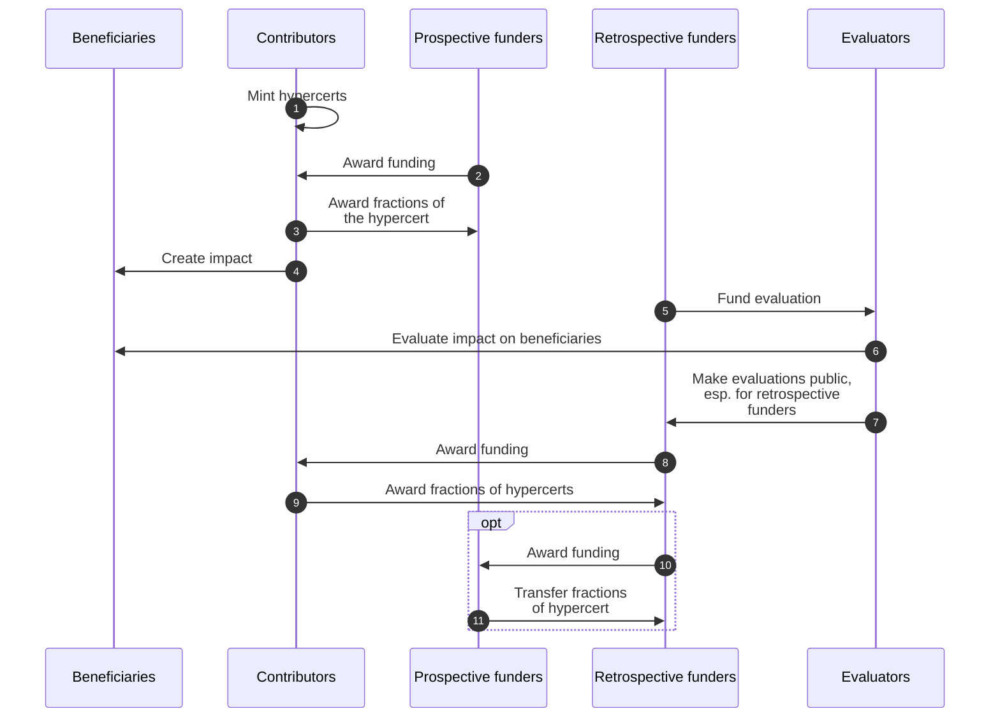
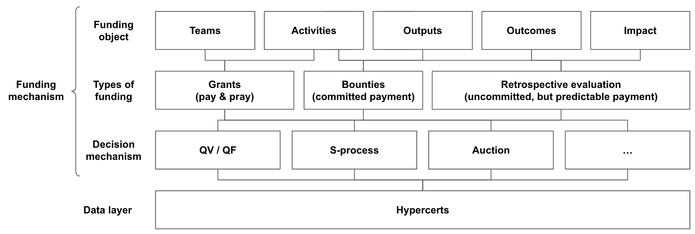

# The Need for Interoperable Impact Funding Systems (IFSs)

### An IFS consists of
- **Actors:** Contributors, funders, evaluators, and beneficiaries
- **Funding mechanisms:** Grants, bounties, retrospective funding, etc.
- **Coordination mechanisms:** Roadmapping, communication forums, etc.
- **A goal:** Maximize the domain-specific positive value created (impact)

The goal will be specific to the impact area, e.g. prevent existential risks from artificial intelligence (AI) would be the goal for the impact area “AI safety.” To achieve these goals, skilled contributors must work with high effort on promising projects. Additionally, for those projects that create impact continuously, sufficient income streams are necessary to cover both their ongoing operating expenses and contributors’ upside incentives.

#### Actors in IFSs
<table class="tg">
<thead>
  <tr>
    <th class="tg-fymr">Type</th>
    <th class="tg-fymr">Subtype</th>
    <th class="tg-fymr">Description</th>
  </tr>
</thead>
<tbody>
  <tr>
    <td class="tg-fymr">Contributors</td>
    <td class="tg-0pky"></td>
    <td class="tg-0pky">People or organizations who do the work</td>
  </tr>
  <tr>
    <td class="tg-fymr" rowspan="2">Funders</td>
    <td class="tg-0pky">Prospective funders</td>
    <td class="tg-0pky">People or organizations who fund work before it is done</td>
  </tr>
  <tr>
    <td class="tg-0pky">Retrospective funders</td>
    <td class="tg-0pky">People or organizations who fund work after it is done</td>
  </tr>
  <tr>
    <td class="tg-fymr" rowspan="2">Evaluators</td>
    <td class="tg-0pky">Scouts</td>
    <td class="tg-0pky">People or organizations who evaluate the potential impact of work before it is done</td>
  </tr>
  <tr>
    <td class="tg-0pky">Auditors</td>
    <td class="tg-0pky">People or organizations who evaluate the impact of work after it is done</td>
  </tr>
  <tr>
    <td class="tg-fymr">Beneficiaries</td>
    <td class="tg-0pky"></td>
    <td class="tg-0pky">People or objects that are impacted by the work</td>
  </tr>
</tbody>
</table>

### Guiding questions for designing IFSs
1. **Projects:** How can we improve the chances that the most promising projects are worked on?
2. **Talent & resources:** How can we attract top talent to contribute to the most promising projects and provide them with the necessary resources?
3. **Effort:** How can we reward contributors for their impact on outcomes?
4. **Sustainable income:** How can we create recurring income streams and financial sustainability for impactful projects?

Markets have been proven very powerful in answering these questions if they are directed towards maximizing profits. As we are directing systems towards maximizing impact, these answers become more challenging. In particular, in an IFS we are facing coordination and incentive problems in funding impact, such as the free-rider problem.

### Example dynamics between actors in an IFS
In order for impact funding systems to be most effective, they should be interoperable regarding (1) funding mechanisms, (2) funding sources and (3) evaluations. In the diagram below you see a potential dynamic between the actors of an IFS. In that scenario hypercerts can account for the prospective funding (steps 2-3) as well as for the retrospective funding (steps 8-9) from different funders. Evaluations are made public and can be discovered through the hypercerts for all funders (steps 5-7). Retrospective funders can reward not only the contributors but also the prospective funders (steps 10-11).

### Hypercerts as a data layer for IFSs
By serving as a single, open, shared, decentralized database hypercerts lower the transaction costs to coordinate and fund impactful work together. This is important because the optimal funding decisions of a single funder depends on the funding decision of all other funders. For instance, some work is only impactful if a minimum funding is provided: The impact is non-linear in the funding amount, e.g. half a bridge is not half as impactful as a full bridge. Other work might be over-funded, i.e. the impact of an additional dollar is basically zero. Ultimately, funders want to find the highest impact for each additional dollar spend (cf. S-process as in Critch, 2021). Today multi-funder coordination on impact funding is prohibitively expensive, leading to suboptimal efficiency in impact capital allocation.  Through hypercerts the funding becomes more transparent and the credits for funding impactful work can be easily shared. Coordinating funding becomes easier.

Hypercerts don’t solve this coordination problem by themselves, but build the basis for different decision and funding mechanisms as shown below. Quadratic voting, bargaining solutions, DAO-style votes, milestone bounties, and simple unconditional grants all have their strengths, among others. Hypercerts do not lock in any particular decision-making scheme for funders.

Looking farther into the future: If a large majority of funding across an entire IFS ends up flowing through hypercerts, funders have created the transparency that enables each of them to make the best decisions given the funding decision of everyone else.
