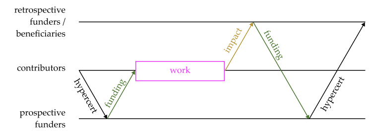
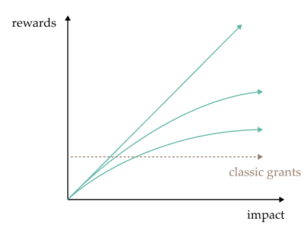

### Introducing retrospective funding

While hypercerts do not impose any specific funding mechanisms, they are especially useful for retrospective funding. The core idea, from the perspective of contributors building impactful goods, is this: if you can reasonably expect to get funded retrospectively for your work once you produce a positive impact, then you can work now, in expectation of a probabilistic future cash flow. In another conception, you are effectively “borrowing” money from this anticipated future cash flow to fund the work in the first place; the expectation of future funding “retro-causes” the impactful work. Retrospective funding may be able to 1) provide incentives for contributors to take on impactful goods projects with a potentially high, but uncertain, impact and 2) create a more efficient IFS by back-propagating signals on what outcomes were impactful post-hoc.

In addition, contributors are able to receive fair compensation by providing outsized impact that will be highly valued. It incentivizes you to create a positive impact, beyond your intrinsic motivation. This does not mean that the most successful contributors to impactful goods automatically have potential upside comparable to some for-profit startup founders (or that they should), just that their potential upside does depend on how much funders later value their past work. This will attract more talent to the impact sector by improving performance-based compensation.

The crucial aspect for this to work: funders need to retrospectively fund impact, and send credible signals that they will do so in the future. Based on these signals contributors form expectations about future retrospective rewards and can start working today to receive them in the future.

Hypercerts facilitate retrospective funding as the impact claims are identifiable, traceable and transferable. Contributors can sell parts of their hypercerts to prospective funders to receive the necessary funding for their project (“activity” in the figure below). The project delivers impact to a larger group (“beneficiaries”), which retrospectively buys the hypercerts from the prospective funder, and from the contributors if they retained some fraction of their hypercerts (the latter is not represented in the figure).

### Increasing rewards

Retrospective funding allows us to increase rewards as more impact is created because impact is easier to observe, measure and prove retrospectively. Increasing rewards – as shown in the next figure – incentivizes contributors to put in their highest effort to produce impact and enables contributors to be rewarded for their talent. Moreover, prospective funders are incentivized to select, fund and support the projects with the highest expected impact, if they also receive retrospective rewards.

Note that retrospective funding should not be used in cases where a significant negative impact is possible since a nongovernmental, permissionless framework can not impose retrospective penalties for negative externalities. See Ofer & Cotton-Barratt (2022) for a discussion of this limitation of retrospective funding.

In some cases we do not expect the retrospective evaluation to be any different than the prospective evaluation, i.e. there is no uncertainty resolved over time as the impact of an activity is already “known” prospectively. In these cases retrospective funding would only complicate the funding mechanism and funding via grants or milestone bounties would be preferable. Retrospective funding is preferable only if uncertainty is resolved over time.

### Impact evaluations

The relevance of impact evaluations will depend on how much their signals influence the funding decisions of retrospective funders (see the potential dynamics in the section on "IFSs"). This is a critical difference to many impact reports today: If a project was funded by a grant, the funders as well as the project want to receive a positive evaluation. If, however, the funding decisions of the retrospective funders are outstanding, they are interested in truthful signals about the impact. Hence, funders value improvements in evaluation methodologies and can fund independent evaluators. Evaluators in turn would build up a reputation for their evaluation methodologies and improve the strength of their signals to retrospective funders.

Impact evaluators can take on a range of forms ranging forms, such as
- Voting by relevant communities or beneficiaries
- Expert panels
- Professional evaluators similar to financial rating agencies
- Automatic monitoring and data collection by sensors and oracles

The most useful form or combinations thereof will depend on the specific requirements of the impact area. For a generalized framework on impact evaluators see Protocol Labs (2023).

While retrospective funding makes impact evaluations financially relevant for funders and contributors, hypercerts enable to pre-commit funding for those evaluations: As impact claims are never forgotten, any actor can at any time commit funding to a future evaluation of these claims.
